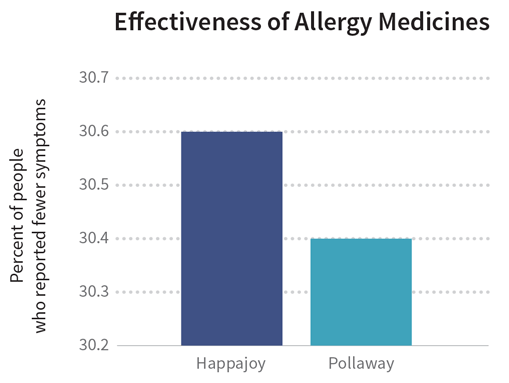
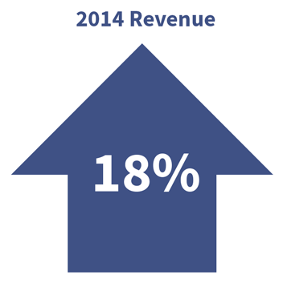

---

title: Erros comuns na visualização de dados
layout: project

---

Queria escrever algum material original sobre esse tema, mas encontrei um capítulo de livro que aborda o assunto muito melhor do que eu conseguiria fazer. Por sorte, ele está sob licença pública – o que significa que pude traduzi-lo e usar como material para o curso. Na verdade, apenas usei o Google Translator e revisei o conteúdo para remover umas poucas inconsistências. Assim, se a escrita parecer um pouco robótica, a culpa é da minha preguiça e não dos autores originais.

Antes de tudo, preciso frisar que o texto a seguir foi adaptado do livro [Data + Design](https://infoactive.co/data-design), de autoria de Trina Chiasson e Dyanna Gregory, com uma licença Creative Commons BY-NC-SA 4.0 Minha tradução não foi endossada por nenhum dos autores originais. [Esse capítulo](https://trinachi.github.io/data-design-builds/ch18.html), especificamente, foi escrito por Kathy Chang, Kate Eyler-werve e Alberto Cairo.

Boa leitura!

***

## Erros comuns na visualização de dados
##### Kathy Chang, Kate Eyler-werve e Alberto Cairo.

Bem-vindo ao último (mas certamente não menos importante) capítulo do livro! Esperamos que você tenha aprendido o suficiente para apreciar o quanto o uso de dados e um bom design podem ajudar você a transmitir sua mensagem. Visualizadores de dados profissionais também ficam entusiasmados com as histórias que desejam contar, mas às vezes se esquecem de seguir algumas boas práticas. Isso acontece até com os melhores de nós. Então, neste capítulo, vamos mostrar quais exatamente são essas boas práticas.

### Não mutile os eixos

Uma das maneiras em que um gráfico pode ser distorcido é ao mutilar um eixo. Isso acontece quando um eixo é encurtado porque uma ou ambas as extremidades estão cortadas.

Às vezes, uma distorção dessas é bastante óbvia. Por exemplo, digamos que existam dois medicamentos para alergia: Happajoy e Pollaway. O gráfico abaixo compara a eficácia desses dois remédios na redução do sofrimento lacrimejamente e congestionado que são os sintomas da alergia.

Se você olhar rapidamente, pode achar que o Happajoy é duas vezes mais eficaz do que o Pollaway, já que sua barra tem o dobro do tamanho da outra. Porém, se você examinar o gráfico mais de perto, verá que o eixo Y está truncado – seus valores vão de de 30,2 até 30,7%. Isso faz a diferença entre os valores parecer maior do que realmente é. Na realidade, a eficácia do Happajoy é apenas 0,2% maior do que a do Pollaway, o que não é tão impressionante quanto os resultados que o gráfico tenta mostrar.

Em outras situações, a distorção causada por um eixo truncado pode ser mais sútil. Por exemplo, o próximo gráfico mostra as vendas de Happajoy entre Janeiro e Abril de 2014.

À primeira vista, não parece haver  nada de errado aqui. O eixo Y começa no zero, então isso não é um problema. A questão crítica é que, dessa vez,  o eixo X que foi cortado: o gráfico mostra as vendas de menos da metade do ano. Exibir um período de tempo como esse pode passar uma impressão errada, especialmente se estivermos lidando com coisas que passam por ciclos. E, adivinhe, a venda de remédios para alergia passa por um ciclo sazonal, já que os sintomas de alergia são tipicamente mais altos na primavera e mais baixos no inverno.

Qual seria a melhor maneira de mostrar as vendas do Happajoy? Algo como o gráfico abaixo:

Este gráfico mostra o mesmo conjunto de dados, mas o eixo y é proporcional e o eixo x abrange dois anos completos, em vez de apenas alguns meses. Podemos ver claramente que as vendas caíram no inverno e subiram na primavera, mas a taxa não mudou muito de ano para ano. Na verdade, as vendas foram um pouco menores em 2014 do que em 2013.

Ao comparar os dois últimos gráficos, você vê como as histórias deles são diferentes? Se você fosse um investidor e visse o gráfico com eixos truncados, poderia dançar alegremente pelas ruas, já que aparentemente sua empresa está indo muito bem. Por outro lado, se você visse o gráfico com eixos proporcionais, provavelmente estaria procurando aspirina para tratar a dor de cabeça que essa queda nas vendas vai causar.

Portanto, preste muita atenção nos eixos. Às vezes, essas distorções são feitas com o propósito de enganar os leitores, mas também pode ser que quem fez o gráfico não saiba como esses cortes podem distorcer uma visualização.

### Não omita variáveis importantes

> “O primeiro princípio é que você não deve enganar a si mesmo - e você é a pessoa mais fácil de enganar.

*Richard Feynman, em discurso na formatura de 1974 da Universidade Caltech*

Sabe quando pessoas famosas são criticadas por algo que disseram e respondem que a frase foi tirada de contexto? Contexto é importante, especialmente quando tratamos de dados. 

É muito fácil se enganar e deixar de fora variáveis que podem afetar o modo como você os interpreta. Portanto, sempre que estiver examinando uma variável e suas relações, pense cuidadosamente no ecossistema em que ela existe e procure outras variáveis que podem afetar a que você está estudando.

É mais fácil falar do que fazer, entretanto. Por exemplo, o mapa abaixo mostra o líder de mercado no ramo de remédios para alergia em cada estado americano: o Happajoy lidera nos estados azul-escuros, enquanto o Pollaway lidera nos estados azul-claros. Olhando superficialmente, parece que o Happajoy lidera todo o mercado nacional. Entretanto, para vermos uma imagem completa da situação, precisamos prestar atenção em outras variáveis.

Por exemplo, o gráfico de barras abaixo mostra uma divisão da participação de mercado em cada estado. (Nós só vamos olhar para os estados continentais do oeste, por enquanto.) As margens pelas quais Happajoy lidera são significativamente menores do que as margens pelas quais Pollaway lidera.

Combine as informações do gráfico de barras com a tabela abaixo. O total de vendas nos estados em que a Happajoy é líder também é significativamente menor do que o total de vendas nos estados em que a Pollaway é líder. Quando você soma os números, as vendas totais da Pollaway são mais que o dobro das vendas da Happajoy. Supondo que um padrão similar se mno resto do país, ainda seria correto dizer que a Happajoy é a líder do mercado nacional de remédios para alergia?

|States|Happajoy|Pollaway|
|--- |--- |--- |
|Wyoming (WY)|299,734|219,037|
|North Dakota (ND)|349,814|279,851|
|South Dakota (SD)|408,343|341,675|
|Montana (MT)|482,400|422,100|
|Idaho (ID)|782,040|654,360|
|Nebraska (NE)|872,320|798,080|
|New Mexico (NM)|1,043,000|834,400|
|Nevada (NV)|1,489,860|993,240|
|Utah (UT)|1,313,300|1,256,200|
|Kansas (KS)|1,414,140|1,183,260|
|Oklahoma (OK)|1,907,500|1,526,000|
|Oregon (OR)|2,027,480|1,481,620|
|Arizona (AZ)|3,014,380|2,883,320|
|Colorado (CO)|1,297,000|3,372,200|
|Washington (WA)|2,069,100|4,138,200|
|Texas (TX)|5,733,200|17,720,800|
|California (CA)|7,608,000|26,628,000|
|Sales Totals|32,111,611|64,732,343|

A lição aqui é que, se você quiser fornecer uma imagem justa do que está acontecendo, terá que expandir seu escopo para mostrar as variáveis que colocam as coisas em seu contexto adequado. Dessa forma, você pode fornecer a seus leitores uma visão mais completa e com mais nuance da história que você está tentando contar.

### Não simplifique demais

A vida é complicada, certo? Os dados podem ser complicados também. Algo complicado é difícil de comunicar, por isso é natural querer simplificar o que os seus dados dizem. Entretanto, não podemos simplificar em excesso. A simplificação excessiva está relacionada ao ponto anterior: trata-se de não expandir o escopo de forma suficiente para oferecer uma imagem clara do que está acontecendo.

Por exemplo, digamos que você seja um investidor da RediMedico, fabricante do Happajoy, e participe da reunião anual de vendas. O CEO da empresa inicia a apresentação com o seguinte gráfico:

O investidor que mora dentro de você olha para esse gráfico e já sonha com as coisas maravilhosas que vai fazer com um retorno tão grande. Entretanto, o analista de dados que mora dentro de você entra em ação e começa a se questionar sobre o que significa o aumento de 18%. Você se pergunta:

- Comparado com o quê?
- Comparado a quando?
- Comparado com quem?

Estas são perguntas que podemos responder com uma visualização! Felizmente, o CEO concorda e apresenta o próximo gráfico, que compara as receitas dos cinco medicamentos mais vendidos pela RediMedico:

Se fizermos alguns cálculos, veremos que o aumento médio da receita entre 2013 e 2014 foi mesmo de 18%. No entanto, vemos também que esse aumento ocorreu principalmente devido a um enorme aumento de 225% na receita de um único medicamento, Exoalgio. A receita de 3 entre 5 medicamentos caiu. O primeiro gráfico conta apenas parte da verdade, enquanto o segundo gráfico conta a verdade inteira apresentando os detalhes por trás daquele número solitário.

Usar um gráfico com um único número e nenhum detalhamento é como escrever uma manchete de jornal sem a notícia. Mantenha a manchete - que a receita melhorou em 18% - e depois adicione o contexto e o plano de fundo que contam toda a história. Tente ser fiel à complexidade do tema, aprofunde-se nos dados e forneça aos leitores uma compreensão melhor dos números que você está apresentando.

### Não escolha o formato errado

Criar uma visualização de dados é um ato de equilíbrio entre forma e função. Ao escolher um formato gráfico para seus dados, você terá que descobrir como se comunicar efetivamente com seu público de uma maneira esteticamente agradável. Isso pode parecer uma tarefa assustadora, mas não tenha medo! Há muita pesquisa que pode nos ajudar com isso. Na verdade, você já foi apresentado a algumas dessas pesquisas no capítulo anterior: o artigo “Graphical Perception”, de Cleveland e McGill, no qual eles classificam como diferentes formas gráficas ajudam as pessoas a fazer estimativas precisas.

Você pode usar essa escala para ajudá-lo a escolher a melhor representação gráfica de seus dados. Área e tom de cor são bons para dar aos leitores uma visão ampla que os ajuda a entender o cenário todo. Gráficos com uma linha de base comum (como gráficos de barra) são bons para ajudar os leitores a fazer comparações precisas.

Como já analisamos exemplos de gráficos de barras e gráficos de linhas neste capítulo, vamos ver alguns gráficos que usam áreas e tons de cor.

O **gráfico de bolhas** acima usa a área para exibir as vendas de medicamento para alergia em cada estado. Com base no tamanho da bolha, você percebe, de modo geral, que Happajoy vendeu mais no Arizona do que no Novo México. Mas você consegue saber quanto, exatamente? A bolha do Arizona é três vezes maior que a bolha do Novo México? Quatro vezes? É difícil dizer. É ainda mais difícil saber quando os tamanhos das bolhas estão mais próximos: Happajoy faz mais sucesso em Utah ou no Kansas?

Nós nos deparamos com o mesmo problema com o próximo gráfico, que usa tons de cor para representar as vendas de Happajoy: a Califórnia está mais escura do que o Texas, mas quanto? Duas vezes? Três vezes? Ninguém sabe dizer. É por isso que gráficos que usam área e tons de cor são melhores para dar um panorama do cenário do que para fazer comparações precisas.

Além da área e de variações na cor, ângulos também não são muito bons para fazer estimativas precisas. É por isso que é tão difícil comparar dois gráficos de pizza, como no exemplo abaixo.

Já é bem difícil comparar com precisão as fatias no mesmo gráfico de pizza. Comparar fatias em gráficos de pizza diferentes é ainda pior. Se o objetivo deste gráfico é ajudar os leitores a comparar as receitas de um ano para o outro, então algo como um gráfico de barras teria sido uma escolha melhor.

Essa é o xis da questão: pense em quais formas gráficas facilitarão melhor as tarefas que você deseja que seus leitores façam.

### Apresente os dados de diversas maneiras

Nós acabmos de ver como diferentes formas gráficas são boas para fazer coisas diferentes. Então, o que você faz quando tem muitos dados e deseja mostrar diferentes aspectos desses dados, mas também não quer sobrecarregar seu público com um gráfico excessivamente complicado? Uma maneira de lidar com esse desafio é apresentar seus dados de várias maneiras. Você pode exibir vários gráficos individualmente, cada um mostrando um aspecto diferente dos dados, para que seu público-alvo tenha uma visão mais precisa dos dados como um todo.

Por exemplo, digamos que o CEO da RediMedico queira mostrar aos investidores como a Happajoy está vendendo nos Estados Unidos desde que foi introduzida no mercado há dez anos. Os dados disponíveis consistem nas vendas do medicamento em todos os estados e em todos os anos desde 2004. Você é o funcionário sortudo que vai precisar dar um jeito de apresentar tanto o quadro geral quanto as nuances nesses valores.

Vamos começar com o grande panorama. Lembra que as formas gráficas que usam área ou tom de cor são são melhores para fornecer uma visão ampla? Usar um mapa de cores para cada ano que o Happajoy esteve no mercado pode ser útil para mostrar como as vendas se alteraram geograficamente e ao longo do tempo.

Agora vamos passar para os detalhes. Digamos que a RediMedico começou a investir muito em publicdade na Califórnia e em Nova York há alguns anos, e os investidores estão se perguntando como estão as vendas nesses estados. Usando o mesmo conjunto de dados, você pode fornecer uma visão mais detalhada:

Ou você pode comparar as vendas em estados diferentes:

Viu? Mesmos dados, apresentações diferentes. Se você quer mostrar para os leitores lados diferentes da mesma história, mostre para eles diferentes formas gráficas.

### Use anotações textuais

Dizem que uma imagem vale mais que mil palavras, mas isso não significa que você deve esquecer as palavras por completo! Até mesmo suas visualizações mais bonitas e elegantes podem usar texto para destacar ou explicar coisas para o público. Isso é especialmente útil quando você apresenta várias camadas de informações. Assim, suas anotações podem ajudar os leitores a conectar as várias partes em um todo compreensível. E, obviamente, você não está lendo este livro para fazer visualizações chatas, certo? Boas visualizações engajam a audiência, e por isso adicionar texto é uma ótima maneira de abordar questões que podem surgir quando leitores curiosos examinarem seu gráfico.

Por exemplo, vamos voltar às vendas da Happajoy. Se você vir um gráfico como o seguinte:

Você pode acabar se perguntando o que aconteceu entre 2009 e 2010. Por que houve uma queda tão acentuada na receita? Nesse caso, seria útil adicionar algum texto:

Então, sempre que você criar uma visualização, pense sobre o "e daí?" do seu gráfico: por que as pessoas deveriam ligar para as informações que você está apresentando? Adicione anotações para ajudá-los a entender por que devem se importar. Escreva um título que chame a atenção, uma boa introdução que destaque pontos de dados interessantes e uma boa narrativa que estruture sua visualização logicamente. Boa escrita é uma parte importante de boas visualizações.

### Estudo de caso sobre um infográfico incrível

Para encerrar este capítulo, vamos dar uma olhada em todas essas dicas na prática, examinando um [infográfico do The New York Times](
http://archive.nytimes.com/www.nytimes.com/2013/10/16/health/uganda-fights-stigma-and-poverty-to-take-on-breast-cancer.html) sobre câncer de mama. Os designers organizaram a informação em uma narrativa interativa com estrutura passo-a-passo. 

Na primeira tela, você vê um gráfico de bolhas que oferece uma noção geral de quais países têm mais casos novos de câncer de mama. Depois de clicar em “Begin”, você verá um gráfico de dispersão com eixos proporcionais. Ele mostra que existe uma correlação inversa entre a detecção do câncer de mama e a mortalidade: quanto mais mulheres são detectadas com câncer de mama, menos mulheres morrem com isso. Um gráfico de dispersão é uma boa maneira de mostrar correlações entre variáveis, e um gráfico de bolhas é uma boa maneira de mostrar uma visão geral, então os designers escolheram formas gráficas que combinavam bem com o que eles queriam mostrar.

Observe como os designers escreveram uma boa manchete  que chama a atenção do leitor (“Onde o câncer de mama mata?”) e um breve texto que destaca outro aspecto desse gráfico de dispersão - que países altamente desenvolvidos têm taxas de diagnóstico mais altas (e taxas de mortalidade mais baixas) enquanto o oposto acontece no mundo em desenvolvimento. 

À medida que você continua clicando em “Próximo”, os designers te orientam mais profundamente no gráfico de dispersão, destacando alguns países e fornecendo uma anotação que fornece mais informações sobre cada grupo. Sem as anotações, ficaríamos com um gráfico de dispersão bem direto ao ponto, que deixaria pouco espaço para exploração. Com anotações úteis e bem colocadas, podemos ver relacionamentos que, de outra forma, talvez não tivéssemos percebido.

Os designers também apresentam os dados de várias maneiras. Eles usam cores para adicionar outra camada de detalhe: o status de desenvolvimento de vários países. Além disso, se você tiver curiosidade sobre as estatísticas de um país específico, pode passar o mouse sobre o ponto desse país para obter mais detalhes.

Por fim, adicionando anotações úteis e mostrando os dados de várias maneiras, esse interativo apresenta os dados em um contexto que não deixa de fora variáveis ​​importantes ou simplifica demais. Seguindo algumas boas práticas de visualização de dados, os designers criaram um infográfico claro, equilibrado e atraente.
