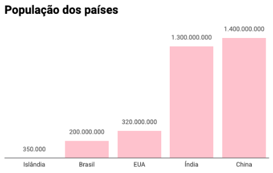
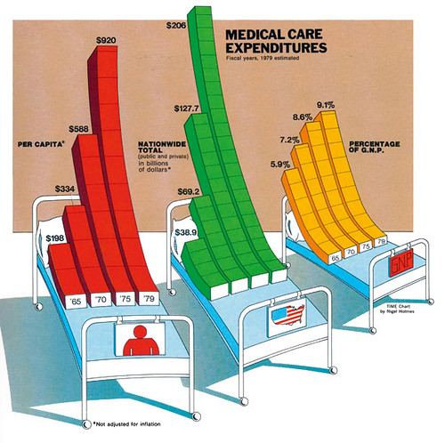

---

layout: project

---

# Introdução à visualização de dados
##### Rodrigo Menegat

Antes de começarmos o módulo pra ver, vale a pena apresentar alguns conceitos fundamentais. 

Nesse texto, que fala de várias coisas que vou abordar também nas vídeo-aulas, pretendo explicar **o que é** visualização de dados e discutir, ainda que superficialmente, **alguns dos conceitos teóricos que estão por trás de um bom gráfico**.

De saída, acho bom delimitar do que raios estamos falando para evitar algumas confusões comuns.

### Visualização de dados e infografia

No Estadão, faço parte da equipe de infografia digital. Meu trabalho vai desde desenvolver ferramentas como o [Basômetro](https://arte.estadao.com.br/politica/basometro/) até elaborar narrativas visuais mais lineares como [esta](https://www.estadao.com.br/infograficos/copa-do-mundo-2018,pela-primeira-vez-mais-de-dois-tercos-dos-jogadores-da-copa-atuam-no-exterior,888766), sobre os jogadores da Copa do Mundo. Quando o restante da redação fala sobre esses produtos, é comum que usem o termo infográfico – mas, se eu quisesse ser chato e excessivamente técnico, poderia dizer que não é bem isso que faço.

Quando falo de infografia, geralmente adoto a definição de [Tattiana Teixeira (2010)](https://repositorio.ufba.br/ri/bitstream/ri/20642/3/Infografia%20e%20Jornalismo.pdf), pesquisadora da Universidade Federal de Santa Catarina. Segundo ela, os infográficos reproduzem de forma visual um acontecimento ou objeto. Como exemplo, cito esses trabalhos publicados por colegas da editoria de arte: [uma reconstrução do acidente do avião da Tam](https://www.estadao.com.br/infograficos/cidades,10-anos-do-maior-acidente-em-um-aeroporto-do-brasil,764239) e um [raio-x de uma baleia jubarte](https://www.estadao.com.br/infograficos/cidades,raio-x-da-baleia-jubarte,810629).

O que há de diferente entre essas produções e o que eu faço? Infográficos narram uma experiência física, que geralmente se desenrola em uma sequência linear clara. No meu trabalho, reúno informações quantitativas, muitas vezes desencontradas e aparentemente desconectadas. Depois, apresento esses dados de forma estruturada.

O parágrafo acima está cheio de jargão e de palavras meio sem sentido. Um exemplo vai tornar as coisas mais claras: imagine um infográfico tradicional sobre um esquema sofisticado de pagamento de propina. Provavelmente ele ia mostrar bonequinhos de políticos segurando maletas, carros deslocando-se até uma empresa de fachada e mais bonequinhos fazendo depósitos ou assinando papéis.

Uma visualização de dados sobre o mesmo tema provavelmente iria concentrar-se nas quantias movimentadas. Quanto dinheiro passou pelo esquema? Podemos representar isso num gráfico de barras. O montante desviado aumentou ao longo do tempo? Então faríamos um gráfico de linhas. 

Note que a visualização de dados **coloca informação quantitativa em contexto**, enquanto a infografia **mostra como um acontecimento se desenrolou**.

### Facilitando tarefas mentais
Sabemos, então, que fazer visualização de dados significa reunir informações quantitativas de modo que o leitor possa extrair algum conhecimento delas. Agora, vamos entender por que e como os gráficos ajudam na tarefa de compreender grandezas.

Pense na população de alguns países. A China tem aproximadamente 1,4 bilhão de habitantes; a Índia, 1,3 bilhão; os Estados Unidos, 330 milhões; o Brasil, 200 milhões; e a Islândia, 350 mil. 

Temos aí um punhado de informação quantitativa e já conseguimos extrair alguns insights desses números: gente pra caramba mora na China e na Índia, bastante gente mora nos Estados Unidos e no Brasil, pouca gente mora na Islândia. Entretanto, ir além disso é difícil. 

Para comparar adequadamente a população de Brasil e China, por exemplo, preciso fazer alguns cálculos chatos.Tive de fazer contas de cabeça (na verdade, usei uma calculadora, como boa pessoa de humanas que sou) para descobrir que a diferença entre os habitantes de um país e outro é de 1,2 bilhão e que há sete vezes mais gente na China do que no Brasil. 

Mesmo assim, os números não são muito claros – 1,2 bilhão é um valor que não faz parte da nossa experiência cotidiana, e portanto é difícil de entender. E imagina como ficariam esses números para Islândia, que é muito menor? O problema só aumentaria.

A questão problemática aí é **o cérebro humano**. Não sou especialista na área e não quero me arriscar falando muito sobre o que entendo pouco, mas milênios de evolução fizeram com que a percepção humana funcionasse de uma maneira específica – e acontece que compreendemos melhor coisas que podemos ver do que coisas que aparecem apenas em uma dimensão abstrata.

Em *The Functional Art (2011)*, Alberto Cairo resume bem como a visualização de dados pode facilitar a percepção e compreensão de temas assim. 

> “Ao dar aos números uma forma adequada, codificando-os visualmente, o gráfico economizou tempo e energia que você perderia se tivesse que usar uma tabela que não foi projetada para ajudar sua mente. O primeiro e principal objetivo de qualquer gráfico e visualização é ser uma ferramenta para seus olhos e cérebro perceberem o que está além de seu alcance natural.”

Vamos ver, na prática, como isso funciona:

Com o gráfico acima, podemos perceber de forma imediata a proporção da população chinesa – ela faz o Brasil, um país também super-populoso, ficar nanico. A Islândia praticamente desaparece. No gráfico, todas essas informações são comunicadas de forma que exige menos esforço mental do que no método anterior, a simples listagem dos valores.

Claro, esse exemplo é bastante simples – provavelmente, comparar grandezas é a tarefa mais simples que a visualização de dados pode ajudar a fazer. Existem diversas outras operações em que gráficos podem ser uma ferramenta poderosa, e algumas são bem mais complexas. São coisas como acompanhar evoluções temporais, visualizar correlações, distribuições, hierarquias e até mesmo incertezas. 

Ao elaborar uma visualização de dados, a parte mais importante do processo é decidir que **operações mentais** você quer facilitar para o leitor. A ideia é fazer com que o público compare grandezas absolutas, perceba tendências temporais, aglomeramentos geográficos ou o quê? Com a resposta em mente, sua missão é escolher o formato que faça isso da maneira mais eficiente possível.

Uma vez que você tenha definido em que operação quer auxiliar, saiba que já existe certo consenso sobre quais tipos de gráfico funcionam melhor para cada tarefa. Gráficos de linha, por exemplo, são ótimos para mostrar variações ao longo do tempo, enquanto [gráficos de dispersão](https://pt.wikipedia.org/wiki/Gr%C3%A1fico_de_dispers%C3%A3o) funcionam bem para demonstrar a correlação entre duas variáveis. O [Dataviz Catalogue](https://datavizcatalogue.com/search.html) (em inglês) é uma boa ferramenta para descobrir qual visualização funciona para o quê.

Seguindo essa receita, é relativamente fácil elaborar um gráfico funcional. Entretanto, estamos falando sobre visualização de dados aplicada ao jornalismo – um ofício que requer, sim, precisão e eficiência, mas que também prima por contar histórias interessantes de forma cativante.

### Duas escolas

Para falar sobre precisão e beleza na visualização de dados, vou apresentar dois caras que discordam em muitas coisas: [Edward Tufte](https://pt.wikipedia.org/wiki/Edward_Tufte) e [Nigel Holmes](https://en.wikipedia.org/wiki/Nigel_Holmes).

O primeiro é o autor de um livro fundamental chamado *“Visual Display of Quantitative Information”* (1983), além de várias outras obras clássicas do campo do design da informação. Uma de suas máximas é a seguinte: quanto menos tinta gastarmos para criar um gráfico, mais efetivo ele é – trata-se do conceito de data-ink ratio.

Em um resumo grosseiro, o que ele quer dizer é que a mensagem de um gráfico é mais clara quando ele não tem elementos decorativos desnecessários. O gif abaixo demonstra como isso funciona:

O gráfico de barras final, sem as anotações redundantes e as cores que não trazem informação alguma, é mais fácil de ler. Com menos distrações, o leitor precisa fazer um esforço cognitivo menor para chegar à ideia central – o que casa muito bem com a ideia de que nosso objetivo é tornar operações mentais menos custosas. Tudo que não é essencial para essa tarefa é considerado chartjunk – “lixo de tabela” que deve ser descartado.

A parte chata dessa perspectiva, com a qual geralmente concordo, é que ela vê a visualização de dados como um ofício predominantemente técnico, com pouco ou nenhum espaço para expressão criativa. Se todos levassem esse pensamento ao extremo, todos os gráficos do mundo pareceriam ter saído de um almanaque contábil. Um dos [projetos mais legais que já fiz](https://vsueiro.com/data-stories/all-the-government-barbecues/pt/), por exemplo, estaria condenado.

E é justamente por isso que o segundo cara que vou apresentar é Nigel Holmes, que fazia seu trabalho com uma abordagem bem diferente. Ele fez carreira na revista Time, onde foi diretor do departamento de gráficos. Lá, desenhava coisas que deviam dar nos nervos de Tufte.

Um de seus trabalhos que mais gosto é esse aqui:

Do ponto de vista de Tufte, esse é um material bem problemático – as barras estão desalinhadas, têm um efeito tridimensional desnecessário e não são realmente comparáveis. Mas, caramba, ele desenhou barras deitadas em camas! Holmes sacrificou precisão e minimalismo para fazer um gráfico que, apesar de tecnicamente incorreto, é memorável. 

E aí, qual dos dois está certo?

De um ponto de vista essencialmente técnico, Tufte comunica melhor a informação. Se você estiver elaborando um relatório para cientistas ou acionistas, não recomendo antropomorfizar as barras de seu gráfico.

Entretanto, fazer jornalismo – de dados ou qualquer outro tipo – exige cativar o público. Pessoalmente, acho que um bom gráfico é aquele que, quando colocado no topo de uma matéria, consegue ser tão intrigante e atraente quanto um abre em estilo literário ou um lead bombástico. 

Para conseguir isso, às vezes é preciso romper com algumas convenções – em [outro texto](https://rodrigomenegat.github.io/dataviz-1/vanguarda-da-visualizacao-jornalistica) desse módulo, listo projetos que se destacam por fazer exatamente isso. Ainda assim, preciso dar um aviso amigo: se você não é o próprio Nigel Holmes, desenhar barras convalescendo em um leito geralmente é ir longe demais.
