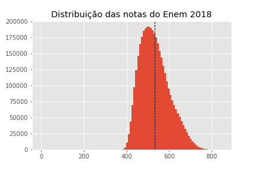
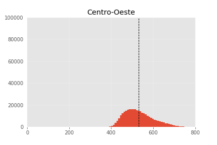
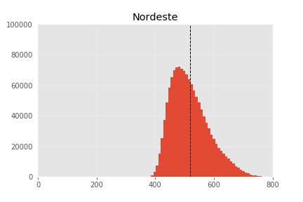
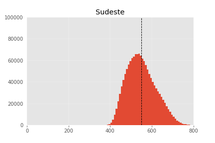
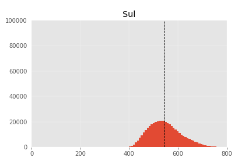
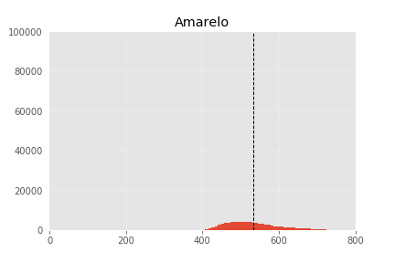
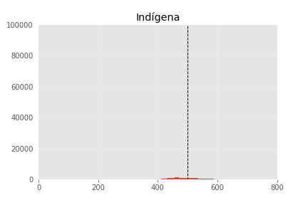
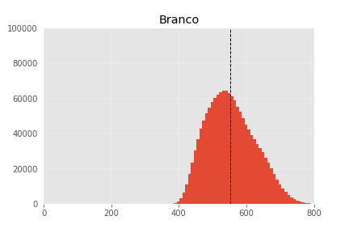
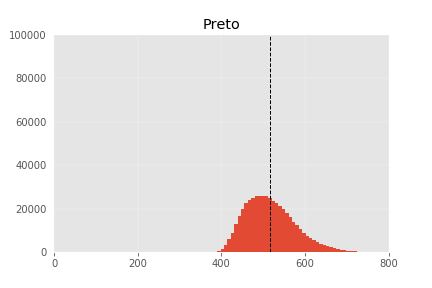
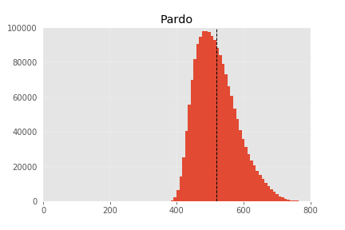

---

layout: project

---

# Visualização de dados na apuração: análise exploratória
##### Rodrigo Menegat

Usualmente, vemos os gráficos como uma forma de apresentar informações **para o leitor**. No fluxo de trabalho usual do jornalismo de dados, sistematizado por Paul Bradshaw (2011) como [“A Pirâmide Invertida do Jornalismo de Dados”](https://onlinejournalismblog.com/2011/07/07/the-inverted-pyramid-of-data-journalism/), a visualização é a última etapa de um processo que começa com a coleta de dados e passa pela limpeza e contextualização do material antes de chegar à comunicação do conteúdo.

Entretanto, é comum usarmos técnicas de visualização com um objetivo diferente, ainda na fase inicial de um projeto. Como vimos em outro texto, gráficos são ótimas ferramentas para organizar e extrair conhecimento de informações complexas. E o que é apurar uma matéria se não obter conhecimento sobre o tema da reportagem?

O processo de visualizar um conjunto de dados para conhecê-lo melhor se chama visualização exploratória. No restante desse texto, vou dar um exemplo prático de como isso funciona e de que forma pode ajudar no trabalho de reportagem.

### Visualização de dados como ferramenta de reportagem

Não é bom começar a produzir qualquer material sem antes saber **qual cara** os dados têm. Elaborar visualizações logo na largada de uma reportagem ajuda a entender melhor os números com que estamos lidando.

Dá até para ter alguma ideia de como são as centenas de milhares de linhas de um banco de dados usando estatística descritiva – ou seja, calculando valores como média, desvio padrão e mediana. Ainda assim, números são mais difíceis de compreender que imagens – e, em muitos aspectos, mais limitados.

Suponha que estamos trabalhando em uma série de reportagens que usa os resultados do Enem 2018. **Queremos saber como os estudantes do Brasil estão indo no exame**. Há várias maneiras de responder à essa pergunta. Poderíamos, por exemplo, apenas reportar qual a nota média de todos os alunos. Isso faz sentido?

De certa forma, sim. A média é uma maneira de resumir a distribuição dos valores em um banco de dados. Usamos matemática para encontrar um valor que representa, de forma aproximada, a experiência de todos os estudantes que fizeram a prova. Entretanto, trata-se apenas de um resumo,  um modelo. Será que esse cálculo retrata a realidade de forma adequada?

Para ter certeza, precisamos dar uma olhada nas notas de **todos os estudantes**. Fazer isso com uma tabela parece uma péssima ideia: imagina ter de ler e contar as pontuações de cada um dos milhões de alunos que fizeram a prova? Só de imaginar, já sinto meu cérebro derreter. 

Por sorte, há um tipo de gráfico que faz exatamente isso: mostra a **distribuição** dos valores de um banco de dados. É o histograma. 

O que ele faz é contar **quantos alunos tiraram cada nota** e representar esse valor com uma barra. Nesse caso, cerca de 175 mil estudantes tiraram uma nota próxima da média – cerca de 532 pontos, valor destacado pela traço pontilhado. 

Veja como há barras mais altas do lado esquerdo da linha. Isso significa que a maioria dos alunos teve notas inferiores do que média aritmética simples de todas as provas. 

Isso acontece, provavelmente, porque há uma minoria de alunos com notas muito altas – ou seja, *outliers* (pontos fora da curva) que fazem com que esse indicador acabe inflacionado. Eles estão representados no gráfico pelas barras pequenas que se acumulam no canto direito do gráfico.

Com esse histograma simples, já descobrimos coisas que não veríamos usando estatísticas descritivas simples – e isso já enriquece qualquer tipo de reportagem. Entretanto, podemos ir além. E se criarmos um desses gráficos para cada região do país?

Vejamos: há um acúmulo de notas menores nas regiões Centro-Oeste, Nordeste e Norte. No Sul e no Sudeste, o pico fica deslocado para a direita, o que revela que as notas tendem a ser mais altas nessas regiões

Seguindo em frente com a exploração, podemos criar gráficos semelhantes agrupando os alunos pela cor de pele que declararam no questionário de inscrição.

Assim como no caso anterior, é possível observar diferenças na forma dos histogramas. Dessa vez, percebe-se que os alunos brancos costumam ter notas mais altas que os demais.

Poderíamos seguir fazendo recortes por um bom tempo: por gênero, faixa de renda, tipo de instituição de ensino em que o estudante está matriculado… 

Cada conjunto de visualizações proporciona um pouco mais de conhecimento sobre a base de dados com que estamos lidando – e, por consequência, mais conhecimento sobre o tema de nossas reportagens. 

Agora, em vez de simplesmente responder se os alunos brasileiros estão indo bem ou mal no Enem, podemos investigar temas como o impacto de diferenças regionais, econômicas e sociais na qualidade da educação. Saímos de uma história simplista e chegamos a uma pauta mais conectada a complexidade dos dados.

Vale ressaltar que o histograma é apenas um de muitos tipos de gráfico, embora seja extremamente útil para compreender aspectos diversos de uma base de dados. É possível explorar os números visualmente de várias outras maneiras, que variam desde um simples gráfico de linhas até coisas mais técnicas como um [diagrama de caixa](https://pt.wikipedia.org/wiki/Diagrama_de_caixa).

Nesse módulo, não vamos conseguir detalhar potencial da visualização de dados como uma ferramenta de exploração. Entretanto, já conseguimos o essencial: perceber que gráficos podem nos ajudar a aprender mais sobre um conjunto de informações e, com isso, elaborar reportagens melhores.

Se você se interessou pelo tema, minha maior recomendação é o livro [The Trutfhful Art](https://www.amazon.com.br/Truthful-Art-Data-Charts-Communication/dp/0321934075), do Alberto Cairo. A obra toda é incrível, mas o capítulo sobre análise exploratória é o ponto mais alto do texto.

Para encerrar, trago um aforismo meio besta, daqueles que, justamente por serem bestas, nos ajudam a lembrar das coisas.

Uma metáfora que uso com frequência para descrever meu trabalho como jornalista de dados é dizer que passo o dia entrevistando números. Levando essa lógica um passo adiante, elaborar gráficos exploratórios é como elaborar um perfil que revela detalhes até então despercebidos no entrevistado. É impossível fazer isso sem passar um bom tempo com ele.